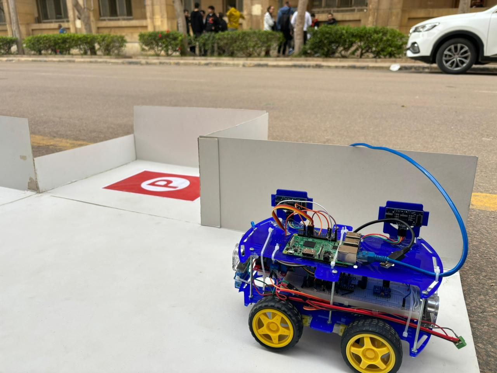
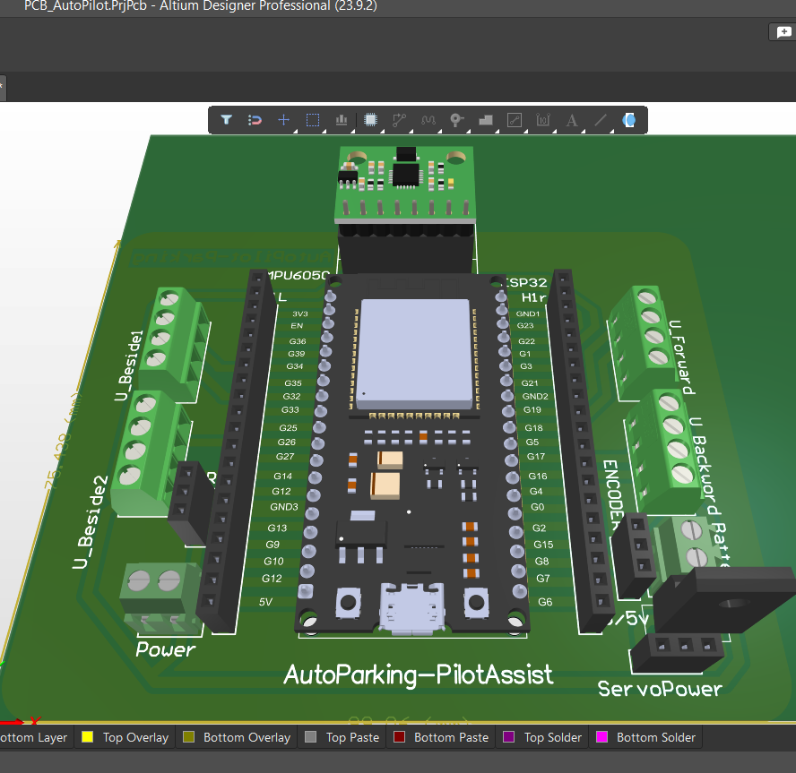

####  *Faculy of Engineering, Alexandria University* Computer Systems and Control Project.
_____
# AutoPark-PilotAssist
An innovative and open-source self-parking system that incorporates ``Advanced Driver Assistance System (ADAS)`` features, including **Autonomous Parking, Pilot Assistant, and Collision Avoidance**. It combines hardware components such as Raspberry Pi 3B, compass , cameras, ultrasonic sensors, and ESP32 with FreeRTOS for efficient multitasking to create a comprehensive autonomous parking solution.

*The project's final version consists of two main components:*

# Auto Park:
   - The camera detects empty parking spaces using an OpenCV script.
   - The parking node initializes, and the robot autonomously parks in the identified space.
   - FreeRTOS tasks manage ultrasonic sensor readings and IMU updates for precise navigation and
     sends real-time sensor readings to the Raspberry Pi.

# **Pilot Assist:**
   - Utilizing a phone camera through TCP/IP with a laptop, the YOLOv8 Nano model is deployed.
   - A Python script initializes the node to send the vehicle's position using PID controller and ultrasonic readings.
   - The system follows the target vehicle, providing a pilot assist feature for smooth navigation.

---

## [Hardware System & PCB](PCB/)

## Previous Versions
I incorporated unit testing and adopted Agile software development practices throughout the project.

- ``Version 0: Manual Phase Park Assist``
  - Initial testing utilizing the Bluetooth module HC-05 and L298n Motor Driver.

- `` Version 1: Sensor Calibration and init ROS Workspace``
   - Focused on calibrating and unit testing sensors for accurate data collection.
   - Tested MPU6050, ultrasonic sensors, and encoders. The ESP32 received and transmitted sensor data through UART (USB) to the Raspberry Pi.
   - initialized the *ROS workspace* for abstraction and modular control, laying the groundwork for further development.
     
- `` Version 2: YOLOv8 Model, Auto Parking Algorithm``
   - Deployed the YOLOv8 model for object detection of the vehicle, using a *PID algorithm* for autopilot implementation.
   - Implemented an auto-parking script with collision avoidance features, significantly enhancing the vehicle's autonomous capabilities.
   - developed *freeRTOS* to manage all sensors in real-time data for ESP32, ensuring efficient multitasking and timely data processing.

